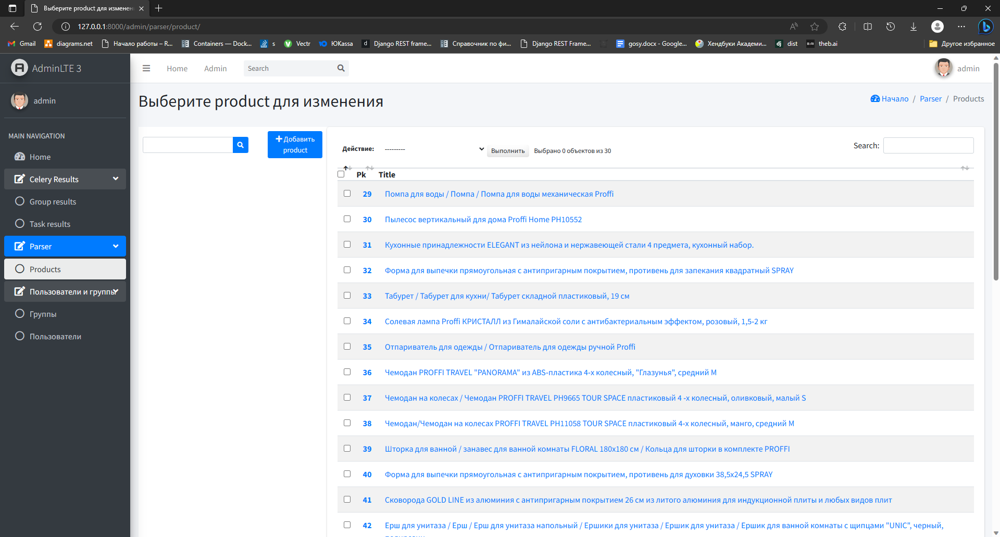

# login-test-o-parser



**Parser ozon products**

<hr/>

## Download

```bash
git clone https://github.com/Maglctea/login-test-o-parser.git
cd login-test-o-parser
```

## Installation

<hr/>

### Presetting
1) Create an .env file and fill it with the pattern from example.env

2) Install requirements
    ```bash
    pip install -r requirements.txt
    ```
3) Run docker-compose for installation Redis and database
   ```bash
   docker-compose up
   ```

   <hr/>

### Django

```bash
   cd backend
```

1) Migrations
   ```bash
   python manage.py migrate
   ```
2) Autocreate superuser (optional). **Login:** admin, **password**: amin
   ```bash
   python manage.py create_superuser
   ```
3) Run app
   ```bash 
   python manage.py runserver 
   ```
4) Start celery worker

   **Windows:**
   ```bash
   celery -A backend  worker --loglevel=info -P eventlet
   ```
   **Linux:**
   ```bash
   celery -A backend  worker --loglevel=info
   ```
   
   <hr/>

## Telegram

8) Go back to the root of the project and run the telegram bot
   ```bash
   python -m bot
   ```
   
<hr/>

## Documentation

### Admin panel

<a href="http://127.0.0.1:8000/admin/">Admin panel</a>

**Login:** admin

**Password:** admin

(p.s this username and password will be used by default if you followed step 2 from the django installation)
### Autodocumentation

1) **Redoc:** <a href="http://127.0.0.1:8000/redoc/">local</a>

2) **Swagger:** <a href="http://127.0.0.1:8000/swagger/">local</a>

### Parsing
1) **GET/POST:** http://127.0.0.1:8000/v1/products/ get all products/start parsing
2) **GET:** http://127.0.0.1:8000/v1/products/<int:id> get a certain product

<hr/>

## Contacts

**Telegram:** https://t.me/maglctea

**VK:** https://vk.com/maglctea